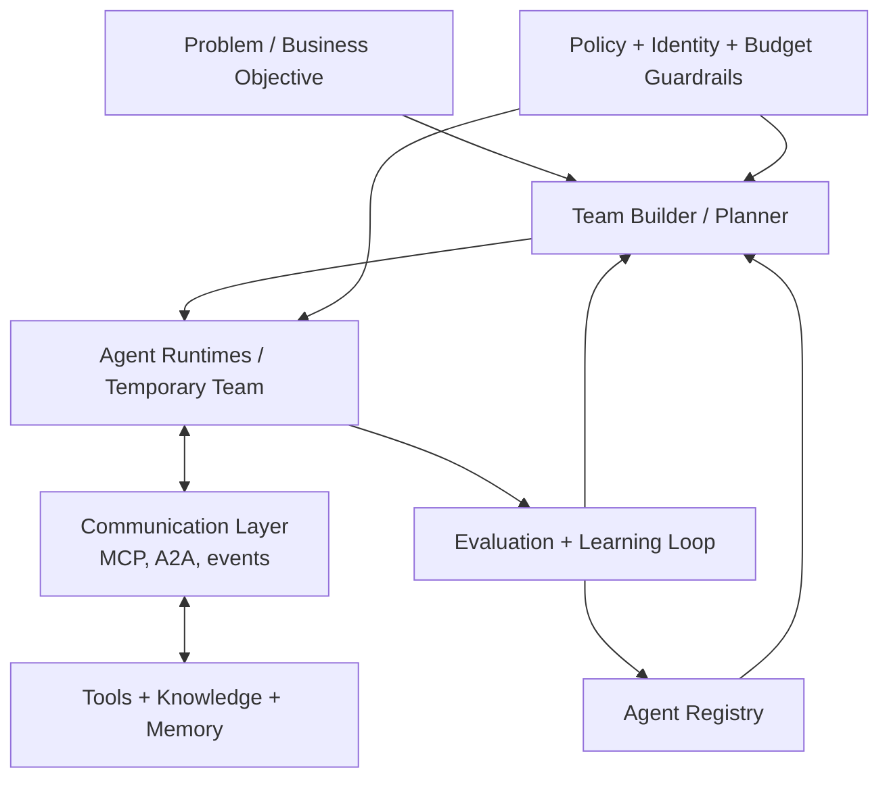

## Main Point

Recently, one of my leaders challenged me with a vision of fully autonomous agentic systems. I did not disagree with the ambition. What stayed with me was a different question: **what kind of engineering architecture would actually make that possible in a company?**

Many teams are already building agents. Some are even building multi-agent systems. But in my experience, they still think about them with an old software mindset. The agent sits behind a request-response facade, usually shaped like another API, and the surrounding system is still designed like a microservice pipeline with better prompts.

That is the mismatch.

The useful interface of an agent is not only an endpoint. It is also a capability surface, a delegation surface, and a policy boundary. This is why protocols such as `MCP` and `A2A` matter. They are not implementation details. They are early signs that agents need a different systems model than classic service decomposition.

I am not claiming this is a brand new insight. Many people in the field are arriving at similar conclusions. But I do think engineering teams, and often senior leaders, still underestimate how much mindset change this requires.

## Why This Matters

The problem is not that teams are ignoring agents. The problem is that even when they adopt them, they often keep the old assumptions:

- interaction is synchronous
- ownership is static
- interfaces are manually wired
- permissions are attached to fixed services
- failures are handled like ordinary retries

This works for narrow workflows. It breaks down when agents need to discover each other, delegate work, wait for approvals, resume later, or operate under explicit cost and time limits.

So the real question is not "how do I add agents to my stack?" It is "what changes when software components are no longer passive services, but active specialists that collaborate under uncertainty?"

## From Service Graphs to Dynamic Teams

The most useful mental model I have found is to stop thinking about agent systems as static pipelines and start thinking about them as **dynamic teams assembled around a problem**.

In that model:

1. The company starts with a problem, not with a predefined workflow.
2. The problem is usually underspecified and refined iteratively.
3. The organization has a pool of agents with different skills, tools, cost profiles, and operating constraints.
4. A temporary team is assembled for a concrete objective.
5. That team gets a budget: time, tokens, tool calls, money, and escalation rights.
6. The outcome is evaluated, and the trace feeds back into the system.

This is much closer to how real organizations operate. Teams form around goals, not around permanent RPC chains.

What I like about this model is that it makes the hidden components visible. In most demos, the only thing you see is the agent. In production, the more important part may be everything around it: registry, communication layer, evaluation loop, policy, and budget control.

## The Engineering Shift

Once you adopt this mental model, several engineering consequences follow immediately.

### 1. Agent interfaces are not just REST

This is the part I think many teams still miss.

If one service calls another with a stable schema and a short-lived response, `REST` is fine. But if one agent needs to discover another agent's capabilities, negotiate a delegated task, stream progress, or call tools through typed schemas, the interface starts looking different.

`MCP` is useful because it exposes capabilities in a machine-readable way: tools, resources, prompts, and schemas. `A2A` is useful because it treats delegation as a first-class operation rather than as an improvised API call. I expect the enterprise stack to split along these lines: one layer for capability access, another for agent-to-agent work.

That is a more interesting shift than "agents can call APIs." We are moving toward systems where agents can be discovered and composed through protocols designed for collaboration rather than only invocation.

### 2. Orchestration becomes a runtime problem

The second shift is that orchestration stops being only a prompt or graph design problem.

If an agent can pause, wait for a human, recover from failure, resume the next day, or retry only one expensive step, then we are already in workflow-runtime territory. Durable execution, checkpoints, replay, idempotent side effects, and structured traces stop being optional.

This is why I find systems like Temporal and LangGraph interesting. Not because they make agents more intelligent, but because they admit an uncomfortable truth: useful agent systems are long-running distributed processes.

By contrast, model serving itself is becoming a commodity. I can buy inference from a cloud provider. I cannot yet buy a clean answer to cross-agent identity, replayable execution, and organization-wide policy control.

### 3. Discoverability becomes a core capability

In a serious multi-agent environment, every agent should answer questions like:

- what can I do?
- what tools can I use?
- what tasks should be routed to me?
- what is my cost profile?
- what is my success history?

This is not a documentation problem. It is part of the execution model.

I increasingly suspect that enterprise agent platforms will compete less on prompts and more on the quality of their capability registry, routing, and trace data.

## A Small Internal Agent Economy

Once teams of agents are formed dynamically, architecture becomes partly an economic problem.

Not in the hype sense. In the engineering sense.

Every non-trivial system will have to decide:

- when to use a cheap agent versus an expensive one
- when to ask a verifier to re-check work
- when to escalate to a stronger model
- when to stop because the budget is no longer justified
- how to route work based on expected value, not only raw quality

This is why I wanted to keep the idea of an **agent economy** in the article, even after trimming it. A temporary team should not be allowed to consume unlimited time and money just because it can keep thinking.

The recent paper **Self-Resource Allocation in Multi-Agent LLM Systems** is useful here because it treats coordination as a resource-allocation problem. And **The Agentic Economy** makes a broader point that I also find relevant inside companies: when communication becomes cheaper, the structure of the system changes, not only its speed.

My version of this idea is simpler and more practical. Inside the enterprise, agent systems will need explicit budget policies, routing rules, and escalation thresholds. Otherwise "autonomy" just becomes an expensive form of drift.

## The Hardest Unsolved Layer

For me, the hardest part is still identity and authorization.

This problem is much more difficult than the standard enterprise `RBAC` model we use for human users and fixed services. With agents, the situation changes constantly:

- agents can be created dynamically
- prompts can change their effective responsibilities
- the same agent may act under different delegations
- tool access may become invalid after a role change
- permissions that were safe yesterday may be unsafe after an update

This is why I think the control plane matters so much. Without an explicit layer for identity, delegation, budget, and auditability, the rest of the architecture is fragile no matter how smart the model is.

The most interesting research question for me is no longer "can agents collaborate?" It is "how do we govern collaboration when the collaborators are dynamic software entities whose behavior can shift faster than our permission models?"

## Where I Think This Is Going

I do not think the winning enterprise pattern will be a giant autonomous swarm.

I expect something more structured:

- agents as specialists, not magical general workers
- dynamic teams assembled around goals
- protocol-native communication
- durable workflow runtimes
- budget-aware routing
- explicit policy and identity layers
- evaluation loops that improve the system over time

That is why I keep coming back to the same conclusion: the main challenge is not agent orchestration in the narrow sense. It is learning to design a new operating model for machine collaborators.

## Selected References

1. Qian et al., ["Scaling Large-Language-Model-based Multi-Agent Collaboration"](https://hf.co/papers/2406.07155)
2. Amayuelas et al., ["Self-Resource Allocation in Multi-Agent LLM Systems"](https://hf.co/papers/2504.02051)
3. Ehtesham et al., ["A survey of agent interoperability protocols: Model Context Protocol (MCP), Agent Communication Protocol (ACP), Agent-to-Agent Protocol (A2A), and Agent Network Protocol (ANP)"](https://hf.co/papers/2505.02279)
4. Kandasamy, ["Control Plane as a Tool: A Scalable Design Pattern for Agentic AI Systems"](https://hf.co/papers/2505.06817)
5. Yang et al., ["Agentic Web: Weaving the Next Web with AI Agents"](https://hf.co/papers/2507.21206)
6. Derouiche et al., ["Agentic AI Frameworks: Architectures, Protocols, and Design Challenges"](https://hf.co/papers/2508.10146)
7. Temporal, ["Build resilient Agentic AI with Temporal"](https://temporal.io/blog/build-resilient-agentic-ai-with-temporal)
8. Anthropic, ["Model Context Protocol Documentation"](https://modelcontextprotocol.io/docs/concepts/tools)
9. Google, ["A2A GitHub Repository"](https://github.com/google/A2A)
---
title: "Agents Need a Control Plane, Not Just an Orchestrator"
date: 2026-03-21
draft: true
description: "Enterprise agent systems will not be won by prompt choreography alone. They need capability discovery, communication protocols, durable execution, explicit budgets, and a feedback loop that treats agents as an evolving operating model."
tags: ["AI Agents", "Multi-Agent Systems", "MCP", "A2A", "Software Architecture"]
categories: ["AI Engineering"]
showReadingTime: true
---

## Main Point

I think many teams are building agent systems with the wrong mental model. We are taking the old software decomposition pattern, replacing a few services with LLM calls, and calling that orchestration.
?? this sentens presents too simplified version, team are woking on agents and even try to have a mulitagent systems, however the problem is that they think in term of request/response pattern and agents are after the REST fasade, their interface is not REST, but MCP or A2A or other communication protocols.

That works for demos. It does not yet look like a durable enterprise architecture. 
?? it is not aligned with my tone of voice, this is too simplified version, we need to add more details and complexity to the story.

??I was recently challened by one of my leaders, where he envision the fully autonomous agentic systems, this started my thinking and 

?? next sentecne is overstated this is not my cuurent thesis, other are agree on this also, I want to stress it, and express my expertise and expierienc what I have observed while working on AI software and products
My current thesis is that enterprise agent systems will need something closer to a **control plane for intelligent workers** than a simple pipeline builder. The hard part is not only what one agent can do. The hard part is how agents are discovered, how they communicate, how they are authorized, how they spend budget, and how the whole system learns from failures.

## Why This Matters

?? this is not the main point, I do not want to make this article with such obvious statement, my thesis is event when engineering teams are building agentic systems, they still think old way, the new mindset is needed, and this also is for senior leaders, 
The current generation of agent demos often hides the engineering cost. A task succeeds once in a notebook or inside a framework playground, so we assume it can be operationalized later.

In practice, the engineering problems arrive immediately:

- long-running tasks
- retries after partial failure
- concurrent execution
- memory and checkpointing
- service discovery
- identity and permissions
- observability and audit trails
- cost control across many model and tool calls

This is why I increasingly see agents as a systems problem, not just a prompting problem.

## From Fixed Pipelines to Dynamic Teams

?? Make diagram for this in mermaid format,
?? this is meta architecture of the agentic systems, that learn, spinof the  agents, and the teams, and the communication between them.
?? extend each of this point, each of this should be repsented as a separate component, and the communication between them should be represented as a separate component. 
?? this is the meta architecture of the agentic systems, that learn, spinof the  agents, and the teams, and the communication between them.

The way I want to think about enterprise agent systems is this:

1. A company starts with a problem, not with a workflow.
2. The problem is usually underspecified and must be refined iteratively.
3. The company has a pool of agents that behave like specialists: each has tools, constraints, memory, and a known area of competence.
4. For a concrete objective, the system assembles a temporary team of agents.
5. That team gets an explicit budget: time, tokens, tool calls, money, and escalation rights.
6. The team produces artifacts, decisions, and traces that can be evaluated later.
7. A meta-layer learns from those traces and updates routing, policies, prompts, tool access, and even which agents should exist at all.

This is closer to how organizations really work. Teams are formed around goals. They are constrained by budgets. They fail, escalate, regroup, and learn. The software architecture should reflect that.

## What Research Already Supports

??review the articles, use only the most relevant ones, and the newest ones > 2024

Several papers already support parts of this picture.

`CAMEL` and `AutoGen` showed early that role-based multi-agent conversation can outperform a single monolithic agent on tasks that benefit from decomposition, critique, or negotiation. `MetaGPT` pushed the same idea into a more software-engineering-shaped workflow with standardized operating procedures instead of unconstrained free-form chats.

The two big survey papers, **A Survey on Large Language Model based Autonomous Agents** and **Large Language Model based Multi-Agents: A Survey of Progress and Challenges**, are useful because they make the pattern explicit: memory, planning, communication, tool use, and evaluation are not optional extras. They are the architecture.

More recent work adds two important details. **Scaling Large-Language-Model-based Multi-Agent Collaboration** argues that topology matters: who talks to whom, in what order, and with what routing structure changes performance. And **Self-Resource Allocation in Multi-Agent LLM Systems** is especially relevant to enterprise design because it treats coordination as a resource-allocation problem rather than a vague "let the agents collaborate" slogan.

For me, this is the most important shift: the research is moving from "can multiple agents talk?" to "what communication structure, capability model, and budget policy makes collaboration useful?"

## The Engineering Layer People Underestimate

The interesting part is that multi-agent systems do not only need smarter reasoning. They need boring infrastructure.

If an agent can call tools, delegate work, wait for another service, ask a human for approval, and resume tomorrow, then it is no longer a request-response function. It is a long-running distributed process. That immediately pushes us toward concepts that software engineers already know well:

- durable execution
- replay and checkpointing
- idempotent side effects
- explicit state stores
- asynchronous message passing
- structured traces
- per-step authorization

This is why I think the "agent server" becomes a real concept. Not a thin wrapper around a model, but a runtime that exposes capabilities, carries state, publishes metadata, and survives failure.

## Communication Protocols Will Split by Layer

One non-intuitive thought I keep coming back to is that we probably will not get one universal agent protocol.

Instead, the stack will likely split into layers:

- `MCP` for tool, resource, and prompt access
- `A2A` or similar protocols for agent-to-agent task delegation
- workflow/runtime infrastructure for durable execution, retries, approvals, and auditability

That separation already makes engineering sense.

`MCP` is good for exposing machine-readable capabilities. A server can list tools with schemas, and the client can decide what to call. This is a strong fit for tool access and context injection. But `MCP` alone does not solve the full problem of delegating a long-running objective to another agent and tracking its lifecycle.

`A2A` is closer to that delegation layer. The current design introduces discovery through an Agent Card, task-oriented messaging, and async-first execution patterns. That is much closer to what enterprise systems need when one agent asks another to perform a bounded piece of work.

My guess is that production systems will end up using both. One protocol to discover and invoke capabilities. Another to negotiate and track delegated work.

## Discoverability May Matter More Than Raw Model Quality

Another non-intuitive point: the best enterprise agent system may not be the one with the strongest base model. It may be the one with the best discovery and routing.

If agents cannot answer basic questions such as:

- who can help with this task?
- what can that agent actually do?
- what inputs does it accept?
- what tools can it access?
- how expensive is it?
- what is its historical success rate?

then the system does not scale, even if every individual model is excellent.

This is where an enterprise capability registry becomes important. In the same way that service-oriented systems needed service discovery, agent systems will need discovery for skills, costs, permissions, and quality signals.

I suspect this registry will become more valuable than most prompt libraries.

## The Winner May Be a Managed Hierarchy, Not a Swarm

A lot of agent discourse implies that the future is a fully decentralized swarm of peers.

I am not convinced.

For enterprise systems, a controlled hierarchy may be much more practical:

- a planner or coordinator defines the objective
- specialists execute bounded tasks
- a reviewer or verifier checks outputs
- humans approve high-risk actions

This is less romantic than a self-organizing swarm, but easier to secure, observe, and debug.

Research also points in this direction. `MetaGPT` relies on structured roles and SOPs. `MacNet` shows that communication topology matters. `Self-Resource Allocation in Multi-Agent LLM Systems` suggests that explicit planning over worker capabilities can outperform vague orchestrator behavior. In other words: good structure may beat maximal autonomy.

## Deployment Servers, Runtimes, and the Real Shape of the Stack

If I had to sketch an enterprise deployment model today, it would look something like this:

1. **Agent runtime services**
   Each important agent is deployed as a service with a stable endpoint, identity, metadata, and execution state.

2. **Tool servers**
   External capabilities are exposed through `MCP` servers or similar typed interfaces rather than hidden inside prompts.

3. **Delegation endpoints**
   Cross-agent work is routed through `A2A`-style interfaces, with explicit task IDs, state transitions, and streaming where useful.

4. **Durable workflow engine**
   A system such as Temporal or LangGraph-style persistence handles long-running tasks, retries, resumability, and human-in-the-loop pauses.

5. **Model serving layer**
   GPU-heavy inference runs separately from orchestration so that model serving and agent coordination can scale independently. ?? this is not an issue any more, this is commodity now, and we can use the cloud providers services for this.

6. **Knowledge and trace store**
   Shared read-mostly knowledge, execution logs, tool results, approvals, and postmortems are stored for replay and learning. ?? this is important, and in my opinion not solved yet, 

7. **Policy and identity layer**
   Authentication, authorization, tenancy, budget enforcement, and audit logs are enforced centrally.
   ?? most dificult to do in scale, this is totally differetn to what could be done for human workers, RBAC, roles, permissions, etc., when you have thousands of agents, this is a challenge, especcially when they are emerge dynamically, and they are updated, their responsibilities could be changed via prompt, and previously defined permissions are not valid anymore or not enough.

This is another reason I do not think "just build a team of agents" is enough guidance. Once the system matters, deployment architecture becomes the product.

A good concrete example is the Ray Serve multi-agent `A2A` deployment pattern: separate agent services expose human-chat and agent-to-agent endpoints, while model serving and `MCP` tool servers can scale independently. That separation feels much closer to production reality than a single in-process orchestrator that tries to do everything.

## Durable Execution Is Not Optional

Two recent engineering directions reinforce this.

Temporal is explicitly positioning agent workflows as long-running, failure-prone processes that need retries, resumability, scheduling, and human checkpoints. LangGraph's durable execution model makes a similar point from a different angle: once you introduce checkpoints, replay, interrupts, and idempotent tasks, you are effectively admitting that agent systems are workflows with memory, not simple API calls.

This sounds boring, but I think it is one of the most important engineering truths in the whole space.

The value of the system will often depend less on the cleverness of a prompt and more on whether it can resume after a crash without repeating an expensive sequence of tool calls.

## The Agent Economy Inside the Company

The "team budget" idea is not only a metaphor. There is real multi-agent literature behind it.

The classic reference is **The Contract Net Protocol** from 1980: tasks are announced, capable workers bid, and a manager delegates work based on those responses. In robotics and distributed systems, auction-based task allocation extended this idea because it provides a practical answer to a hard question: who should do what under limited resources?

That older literature suddenly feels relevant again.

Inside a company, an agent economy could mean:

- every task has a token, time, and dollar budget
- cheap agents handle low-value or high-volume work
- expensive agents are escalation paths, not defaults
- agents compete or bid for work based on capability and cost
- routing policies optimize for expected value, not only quality
- post-task evaluation updates future allocation decisions

The recent paper **Self-Resource Allocation in Multi-Agent LLM Systems** fits this framing directly. Newer work such as **Magentic Marketplace** and **The Agentic Economy** expands the idea beyond one company and asks what happens when assistant agents and service agents interact across organizational boundaries.

The non-intuitive consequence is that the real scarce resource may stop being model intelligence and become something else:

- trusted discovery
- good preference data
- reputation
- latency budget
- escalation rights

In other words, the best agent system may look less like a chatbot and more like an internal market with guardrails.

## Memory, Logs, and Feedback May Be More Valuable Than Prompts

Another thought I find increasingly convincing: the most defensible part of an enterprise agent system may be the trace data.

Not the prompt.
Not even the exact model.

The durable value may come from:

- which decompositions worked
- which agents collaborated successfully
- which tool calls failed
- which approvals humans rejected
- which routes were too expensive
- which contexts improved outcomes

If that data is structured and reusable, it becomes a training signal for the whole system. It improves routing, policy, testing, safety rules, and eventually the design of the agents themselves.

This is why I think every serious agent platform will need a learning loop above the individual agents.

## Security Is Still the Hardest Part

I also think security and authorization are under-discussed compared to planning and reasoning.

In an enterprise, one agent calling another is not just a technical hop. It is a question of authority:

- is the agent acting on its own behalf or on behalf of a user?
- what scopes were delegated?
- which tools can be invoked transitively?
- what data can cross team or tenant boundaries?
- who is accountable for a bad action?

The protocol layer helps, but it does not answer the governance question by itself. We will need enterprise identity for agents, least-privilege tool access, signed delegation chains, and full audit trails.

## Where I Think This Is Going

I do not think the winning enterprise pattern will be a giant autonomous swarm.

I think it will be something more structured:

- agents as specialized workers
- explicit protocols for discovery and delegation
- durable workflow runtimes
- strict identity and policy layers
- shared knowledge and trace stores
- budget-aware routing
- feedback loops that continuously reshape the system

If this framing is right, then "agent orchestration" is too small a phrase. What we are really designing is an operating model for machine collaborators.

## References

1. Wang et al., ["A Survey on Large Language Model based Autonomous Agents"](https://hf.co/papers/2308.11432)
2. Guo et al., ["Large Language Model based Multi-Agents: A Survey of Progress and Challenges"](https://hf.co/papers/2402.01680)
3. Wu et al., ["AutoGen: Enabling Next-Gen LLM Applications via Multi-Agent Conversation Framework"](https://hf.co/papers/2308.08155)
4. Li et al., ["CAMEL: Communicative Agents for 'Mind' Exploration of Large Scale Language Model Society"](https://hf.co/papers/2303.17760)
5. Hong et al., ["MetaGPT: Meta Programming for Multi-Agent Collaborative Framework"](https://hf.co/papers/2308.00352)
6. Chen et al., ["AgentVerse: Facilitating Multi-Agent Collaboration and Exploring Emergent Behaviors"](https://hf.co/papers/2308.10848)
7. Qian et al., ["Scaling Large-Language-Model-based Multi-Agent Collaboration"](https://hf.co/papers/2406.07155)
8. Amayuelas et al., ["Self-Resource Allocation in Multi-Agent LLM Systems"](https://hf.co/papers/2504.02051)
9. Ehtesham et al., ["A survey of agent interoperability protocols: Model Context Protocol (MCP), Agent Communication Protocol (ACP), Agent-to-Agent Protocol (A2A), and Agent Network Protocol (ANP)"](https://hf.co/papers/2505.02279)
10. Kandasamy, ["Control Plane as a Tool: A Scalable Design Pattern for Agentic AI Systems"](https://hf.co/papers/2505.06817)
11. Derouiche et al., ["Agentic AI Frameworks: Architectures, Protocols, and Design Challenges"](https://hf.co/papers/2508.10146)
12. Smith, ["The Contract Net Protocol: High-Level Communication and Control in a Distributed Problem Solver"](https://ieeexplore.ieee.org/document/1675516/)
13. Gerkey and Mataric, ["A Formal Analysis and Taxonomy of Task Allocation in Multi-Robot Systems"](https://journals.sagepub.com/doi/10.1177/0278364904045564)
14. Temporal, ["Build resilient Agentic AI with Temporal"](https://temporal.io/blog/build-resilient-agentic-ai-with-temporal)
15. LangGraph docs, ["Durable execution"](https://docs.langchain.com/oss/javascript/langgraph/durable-execution)
16. Google, ["A2A GitHub Repository"](https://github.com/google/A2A)
17. Anthropic, ["Model Context Protocol Documentation"](https://modelcontextprotocol.io/docs/concepts/tools)
18. Bansal et al., ["Magentic Marketplace: An Open-Source Environment for Studying Agentic Markets"](https://hf.co/papers/2510.25779)
19. Yang et al., ["Agentic Web: Weaving the Next Web with AI Agents"](https://hf.co/papers/2507.21206)
20. "The Agentic Economy" (Microsoft Research / arXiv preprint, 2025), [HTML version](https://arxiv.org/html/2505.15799v2)
21. Ray docs, ["Build a multi-agent system with the A2A protocol"](https://docs.ray.io/en/master/ray-overview/examples/multi_agent_a2a/content/README.html)