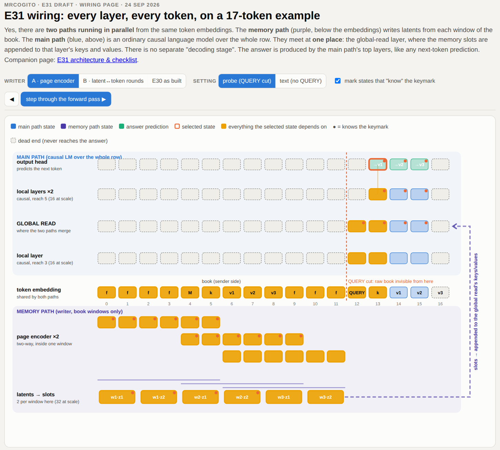


For the last month, agents have run most of my model research, and they are very good at it. But I learned one thing the hard way: **agents drift toward the ordinary.** Give them an unusual idea and they pull it back, one reasonable decision at a time, to the patterns they were trained on. In software that is often what you want. In research it quietly kills the one thing you are there for. Two counters worked for me: an exam built alongside the idea, and a picture of the code that will actually run.


## TL;DR

- **Agents are excellent research engineers and poor research originals.** None of the ideas that moved the project came from them.
- **Unusual ideas drift into ordinary code without anything failing.**
- **Build the test framework together with the idea:** deterministic, reproducible exams aligned with what the idea claims.
- **Review a picture of the code before every launch, and ask for pictures of every result.**

## Twenty-six bits, every time

The number was 26.

My agents had built a new memory design for my research model, trained it and scored it on an exam where the model must recall a planted 32-letter fact, worth 64 bits in total. At 31M parameters it scored 25.7 bits. At 50M, 24.3. On books twice as long, 25. On a harder exam with a decoy, 25.9.

Different sizes, lengths and exams. The same number. Nothing had crashed, the curves looked healthy, and by every signal the loop checked, things were fine.

A number that refuses to move is not a result. It is a fingerprint. To see whose fingerprint it was, you need the exam that produced the number, and then the code that produced the model.

## Why I let agents run my research

[MrCogito](/projects/concept-reasoning/) is my open research project on models that compress a long input into a small set of dense **concepts** and reason over those, instead of attending to every token. If it works, a million-token input becomes affordable on hardware like mine. The architecture story is in a separate post: [A Memory That Reads by Content](/posts/memory-that-reads-by-content/).

I build agent systems by day. I only have evenings for this project, plus seven RTX 3090 GPUs that sit idle while I sleep. So the same kind of agents now run the research at night, with [agent skills](https://github.com/ksopyla/MrCogito/tree/dev/.cursor/skills) for each step: design, implement, run, evaluate, record, report. Andrej Karpathy's [autoresearch](https://github.com/karpathy/autoresearch) is the simplest version of this loop: edit a training script, train for five minutes, keep the change if validation loss improved.

It works, and it produces a flood. In September, agents made 176 commits to the research repo and I made fewer than a hundred, many of theirs between midnight and six in the morning.

I could not read it. At one point I wrote to the agents: *"most of your work and outputs I can't read and process (too much)"*. An audit of one session counted 8,544 words from the agents against 676 from me. That overload is where the drift hides.

## What agents are good at, and where they drift

In one month, the agents implemented new designs within hours, found the training settings that make small models learn at long lengths, built the whole exam suite below in about a day, and ran the same exam at eight lengths and three seeds without getting bored.

What they did not do was produce the ideas that changed direction. My opinion: **agents are strong at the moves that already exist in the literature, and weak at the move that does not.** When an early design failed, they queued the textbook repairs. Each was reasonable, and each failed.

That is not a flaw you can prompt away. A model reaches for the pattern it has seen thousands of times, and in most software that pattern is right. In research, the point is to leave it.

## Counter 1: build the exam together with the idea

The first problem was what I asked the agents to optimise. Validation loss is right for a training recipe, but almost blind for a new memory. A 125M model with a long-range lookup and the same model without it ended at **4.090** and **4.091**: on ordinary text, the next word needs almost nothing from far away. Loss had already fooled me once in public, in my [Gemma-3 post](/posts/gemma-with-concepts/).

**An agent optimises whatever you measure, faster than you can check it. If the measure does not reward your idea, the loop will not find your idea.**

So I built an exam where "better" cannot be argued about, based on a 2025 framework by Schnabel et al.:

- The "book" is a long string of random letters from a four-letter alphabet.
- Far back, a fact is planted: a marker, a two-letter key and a 32-letter value.
- At the end, the model must write the value.

Each random letter is worth 2 bits, so the answer is a **64-bit prize**, zero means chance, and the same seed gives the same books. A full-attention model trains next to every candidate as the ceiling, and a no-memory model checks that the answer does not leak.

One exam was not enough, so the ladder grew with the idea: ignore a decoy, reach further back, follow a four-step chain, cope with filler that looks like text. Writing each rung forced me to say exactly what the idea should do, and more than once that is where I understood it better. The exam also fixes the training rules (a step size three times too large once zeroed every model), and it is versioned, so no one, human or agent, can change it by accident.

That exam is the one that kept returning 26 bits.

## Back to the 26 bits: not my model

After those runs, I asked the agents for an interactive page showing how information flows through the model as the code actually implements it. The first clue was on screen: each note was "a weighted pick of the tokens in its own window". I asked for a full review of the code against my original idea note, which said, in my own words:

> "slots where r token vectors are averaged is not a good idea, we want something which picks the signal from noise in each window"

In the code, each memory slot was **a weighted average of token vectors**, written by a note-taker that could only see **16 tokens back**. Hashed embeddings, which my note said to leave off, were on.

For a moment, all the healthy curves of the past days meant nothing. This had never been my model.

The 16-token view explained the fingerprint. A letter can only be recognised as part of the fact if the fact's marker is in view. After the marker and the key, that covers the first 13 letters of the value; the other 19 look like filler. Thirteen letters at 2 bits each is **26 bits**.

Nothing crashed. The model trained and scored reasonably. It just was not my idea. This is the risk of auto-research I did not expect: not wrong code, but **ordinary code**. Tests do not catch it, because tests check the code the agent wrote, not the idea you had.

## Counter 2: a picture of the code that will run

Now, after implementation and before any launch, I ask for **an interactive diagram of what the code actually implements**: the forward pass that will run, step by step, with a toggle to compare it against the previous design.

Why not rely on the design spec? I have a thorough one. Before any code, a "grill me" skill interviews me until every design decision is pinned down and frozen. But after I approve it, the agents keep changing the code: during implementation, while fixing bugs, while tuning mid-run. Each change is reasonable, and each is a chance to drift. The reference has to be a picture of the code about to execute, not of the plan I approved.

The agent has to trace the real forward pass to draw it, so drift becomes visible. Fifteen minutes of clicking beats reading a thousand lines of diff at 11 pm.

The same applies to results. The agents now report under a communication skill with hard word budgets, and anything bigger than a short table comes as a plot or an interactive page. My attention, not GPU time, is the scarcest resource in the loop.

The design built this way passed every level of the exam at 30M parameters. The 26-bit wall disappeared: 94% of the answer letters recovered, flat across all 32 of them.

## The control that corrected me

The spec also included a cheap control: the old note-taker with a single change, a wider 64-token view. On the short exams, it **matched or beat** my new design. Most of the gain came from context, not from the part of the idea I was proudest of. Only one version of my design pulled ahead, and only when the books got much longer, which is the story of the [companion post](/posts/memory-that-reads-by-content/).

Without that boring control, I would have credited the wrong idea. It can only make your idea look smaller, which is exactly why you need it.

## Six rules before letting agents explore

1. **Write the idea down in your own words**, including what not to do.
2. **Build the exam together with the idea**, and keep it out of the agents' reach.
3. **Review a picture of the code before every launch.**
4. **Ask for pictures, not paragraphs.** If you cannot read the output, you cannot catch the drift.
5. **Always include the boring control.**
6. **Treat a number that never moves as a question**, not a result.

## What this does not prove

It is one month and one project, and the drift is one clear case, not a statistic. The exam is synthetic: random letters test the mechanism, not language. The next rung plants facts in real prose.

## What I believe now

Auto-research is real. For a solo researcher with evenings and seven GPUs, it changes what is possible.

But the loop amplifies what you give it. Give it a blind metric and it produces well-documented noise. Give it an unusual idea without a way to check the build, and it returns a more common idea. Give it an exam built with the idea, a picture of the code before launch, results you can read at a glance and a boring control, and it becomes the best research assistant I have had.

The ideas, the questions and the suspicion are still the researcher's job. I do not think that is a temporary limitation to wait out. It is the division of labour I want.

## References

1. Karpathy, A. (2026). [**autoresearch**](https://github.com/karpathy/autoresearch). GitHub repository.
2. Schnabel, T. et al. (May 2025). [**Lost in Transmission: When and Why LLMs Fail to Reason Globally**](https://arxiv.org/abs/2505.08140). Microsoft Research. NeurIPS 2025. arXiv:2505.08140
3. Sopyla, K. (Jul 2026). [**Replacing Gemma-3 Global Attention with Concepts (Toward Longer Context)**](https://ai.ksopyla.com/posts/gemma-with-concepts/). ai.ksopyla.com
4. MrCogito sources: [agent skills, including grill-me and research-comms](https://github.com/ksopyla/MrCogito/tree/dev/.cursor/skills) · [the exam ladder](https://github.com/ksopyla/MrCogito/blob/dev/docs/engineering_specs/capability_suite.md) · [the review that found the drift](https://github.com/ksopyla/MrCogito/blob/dev/docs/experiments_specs/ahead/E30_sliding_window_perceiver.md)

*All numbers are from my own runs on two servers with 3 and 4 RTX 3090 GPUs. Independent reproduction has not been published.*
