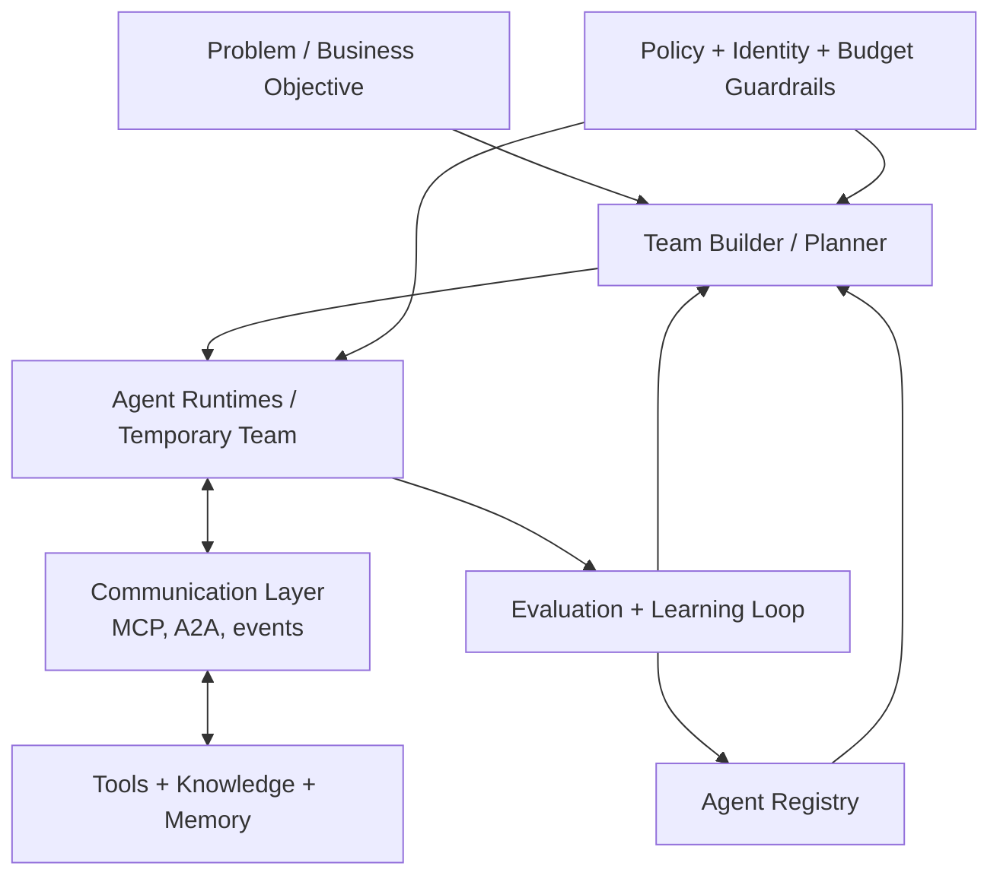

Recently, one of my leaders showed me a single slide. The vision was simple: *set the problem and let it go. Reuse other agents to solve it.*

My first reaction was defensive. We were already building agentic workflows. We had agents, orchestration, tools, and multi-step automation. So why did it feel like he was describing something we still did not have?

After sitting with it for a while, I realized the uncomfortable part: he was right. We were not really building agentic systems. We were building a **REST-shaped facade around agent workflows**.

That realization forced me to change the questions I was asking. I stopped asking:
- what should the input look like?
- which endpoints do we need?
- where should the orchestration layer live?

And I started asking harder questions instead:
- what is an agent's actual interface?
- how should agents communicate?
- what capabilities, identity, and budget boundaries do they need?
- what kind of engineering architecture would actually make this work inside a company?

Honestly, the realization was liberating. I had been stuck optimizing the wrong abstraction, and once I saw it, I found new energy for the problem.

That is the mismatch I keep seeing now. Many teams are already building agents. Some are even building multi-agent systems. But in my experience, they still approach them with an old software mindset. The agent sits behind a request-response facade, usually shaped like another API, and the surrounding system is still designed like a microservice pipeline with better prompts.

The useful interface of an agent is not only an endpoint. It is also a capability surface, a delegation surface, and a policy boundary. This is why protocols such as `MCP` and `A2A` matter. They are not implementation details. They are early signs that agents need a different systems model than classic service decomposition.

I am not claiming this is a brand new insight. Many people in the field are arriving at similar conclusions. But I do think engineering teams, and often senior leaders, still underestimate how much mindset change this requires.

## Why This Matters

The problem is not that teams are ignoring agents. The problem is that even when they adopt them, they often keep the old assumptions:

- interaction is synchronous
- ownership is static
- interfaces are manually wired
- permissions are attached to fixed services
- failures are handled like ordinary retries

I see this in our own work. We add a new agentic solution, but we still treat it as a tool behind `MCP`, where the entire responsibility of preprocessing the agent's response and extracting the right information stays on the caller. The agent does something interesting inside, but from the outside it still looks and behaves like an API call. That is the old model leaking through.

It works for narrow workflows. It breaks down when agents need to discover each other, delegate work, wait for approvals, resume later, or operate under explicit cost and time limits.

So the real question is not "how do I add agents to my stack?" It is "what changes when software components are no longer passive services, but **active specialists** that collaborate under uncertainty?"

## From Service Graphs to Dynamic Teams

I started educating myself the old-fashioned way: books, talks, papers. Then I started drawing doodles in my notebook. What if each service had its own identity? I drew services with faces and gave them names: Tom, Caroline, Mark. What if they could speak? How would I talk to them? How would they talk to each other?

It sounds silly, but it worked. The moment I stopped thinking about services as boxes with inputs and outputs and started thinking about collaborators, the architecture questions changed completely.

The most useful mental model I have found is to stop thinking about agent systems as static pipelines and start thinking about them as **dynamic teams assembled around a problem**.

In that model:

1. The company starts with a problem, not with a predefined workflow.
2. The problem is usually underspecified and refined iteratively.
3. The organization has a pool of agents with different skills, tools, cost profiles, and operating constraints.
4. A temporary team is assembled for a concrete objective.
5. That team gets a budget: time, tokens, tool calls, money, and escalation rights.
6. The outcome is evaluated, and the trace feeds back into the system.

This is much closer to how real organizations operate. Teams form around goals, not around permanent RPC chains.

What I like about this model is that it makes the hidden components visible. In most demos, the only thing you see is the agent. In production, the more important part may be everything around it: registry, communication layer, evaluation loop, policy, and budget control.

## The Engineering Shift

Once you adopt this mental model, several engineering consequences follow immediately.

### 1. Agent interfaces are not just REST

This is the part I think many teams still miss.

If one service calls another with a stable schema and a short-lived response, `REST` is fine. But if one agent needs to discover another agent's capabilities, negotiate a delegated task, stream progress, or call tools through typed schemas, the interface starts looking different.

`MCP` is useful because it exposes capabilities in a machine-readable way: tools, resources, prompts, and schemas. `A2A` is useful because it treats delegation as a first-class operation rather than as an improvised API call. I expect the enterprise stack to split along these lines: one layer for capability access, another for agent-to-agent work.

That is a more interesting shift than "agents can call APIs." We are moving toward systems where agents can be discovered and composed through protocols designed for collaboration rather than only invocation.

### 2. Orchestration becomes a runtime problem

The second shift is that orchestration stops being only a prompt or graph design problem.

In microservices, we developers define every route and handoff. We control which service calls which, in what order, with what data. That makes us the architects of every interaction. We trust it because we built it.

With agents, that control disappears. And I will be honest: my first instinct was fear. What if the agent does its own thing? What if it calls the wrong tool, spends too much, or takes a path I did not anticipate? Letting go of explicit orchestration felt like giving up the thing that made the system predictable.

But that is exactly the shift. If an agent can pause, wait for a human, recover from failure, resume the next day, or retry only one expensive step, then we are already in workflow-runtime territory. Durable execution, checkpoints, replay, idempotent side effects, and structured traces stop being optional. They become the new foundation of trust, replacing the static routes we used to rely on.

By contrast, model serving itself is becoming a commodity. I can buy inference from a cloud provider. I cannot yet buy a clean answer to cross-agent identity, replayable execution, and organization-wide policy control.

### 3. Discoverability becomes a core capability

In a serious multi-agent environment, every agent should answer questions like:

- what can I do?
- what tools can I use?
- what tasks should be routed to me?
- what is my cost profile?
- what is my success history?
- how can I evolve?

This is not a documentation problem. It is part of the execution model.

Enterprise agent platforms will compete less on individual agent prompts and more on the quality of their capability registry, routing, and trace data. The best system will not be the one with the strongest base model or tool-calling capabilities. It will be the one where agents can find each other and negotiate work efficiently.

## A Small Internal Agent Economy

Once teams of agents are formed dynamically, architecture becomes partly an economic problem.

Not in the hype sense. In the engineering sense.

Every non-trivial system will have to decide:

- when to use a cheap agent versus an expensive one
- when to ask a verifier to re-check work
- when to escalate to a stronger model
- when to stop because the budget is no longer justified
- how to route work based on expected value, not only raw quality

A temporary team should not be allowed to consume unlimited time and money just because it can keep thinking.

The recent paper **Self-Resource Allocation in Multi-Agent LLM Systems** is useful here because it treats coordination as a resource-allocation problem. And **The Agentic Economy** makes a broader point that I also find relevant inside companies: when communication becomes cheaper, the structure of the system changes, not only its speed.

This is the double-edged part. On one hand, you need to trust agents and give them freedom to act. On the other hand, you need hard limits to prevent them from drifting in ways that are not in the best interest of the company. Otherwise "autonomy" just becomes an expensive form of drift. Inside the enterprise, agent systems will need explicit budget policies, routing rules, and escalation thresholds.

## The Hardest Unsolved Layer

For me, the hardest part is still identity and authorization.

This problem is much more difficult than the standard enterprise `RBAC` model we use for human users and fixed services. With agents, the situation changes constantly:

- agents can be created dynamically
- prompts can change their effective responsibilities
- the same agent may act under different delegations
- tool access may become invalid after a role change
- permissions that were safe yesterday may be unsafe after an update

This is why I think the control plane matters so much. Without an explicit layer for identity, delegation, budget, and auditability, the rest of the architecture is fragile no matter how smart the model is.

The most interesting question for me is no longer "can agents collaborate?" It is "how do we govern collaboration when the collaborators are dynamic software entities whose behavior can shift faster than our permission models?" Right after discoverability and orchestration, this is the problem I think will define whether enterprise agent systems actually work at scale.

## Where This Started, And Where I Am Now

I keep thinking about that single slide. *Set the problem and let it go.*

At the time, I thought we were already doing that. Now I realize we were doing something much more modest: wrapping careful, hand-wired workflows in agent-shaped packaging.

I am at the beginning of this shift, not the end. But a few things are already clear to me: agents need real protocols, not REST facades. They need budgets, not unlimited autonomy. They need identity and policy layers that can keep up with how fast they change. And the engineering teams building them, myself included, need to accept that the old intuitions about service design will not carry us through.

The first step is not a new framework. It is a willingness to rethink the assumptions that got us here.

## Selected References

1. Qian et al., ["Scaling Large-Language-Model-based Multi-Agent Collaboration"](https://hf.co/papers/2406.07155)
2. Amayuelas et al., ["Self-Resource Allocation in Multi-Agent LLM Systems"](https://hf.co/papers/2504.02051)
3. Ehtesham et al., ["A survey of agent interoperability protocols: Model Context Protocol (MCP), Agent Communication Protocol (ACP), Agent-to-Agent Protocol (A2A), and Agent Network Protocol (ANP)"](https://hf.co/papers/2505.02279)
4. Kandasamy, ["Control Plane as a Tool: A Scalable Design Pattern for Agentic AI Systems"](https://hf.co/papers/2505.06817)
5. Yang et al., ["Agentic Web: Weaving the Next Web with AI Agents"](https://hf.co/papers/2507.21206)
6. Derouiche et al., ["Agentic AI Frameworks: Architectures, Protocols, and Design Challenges"](https://hf.co/papers/2508.10146)
7. Temporal, ["Build resilient Agentic AI with Temporal"](https://temporal.io/blog/build-resilient-agentic-ai-with-temporal)
8. Anthropic, ["Model Context Protocol Documentation"](https://modelcontextprotocol.io/docs/concepts/tools)
9. Google, ["A2A GitHub Repository"](https://github.com/google/A2A)
