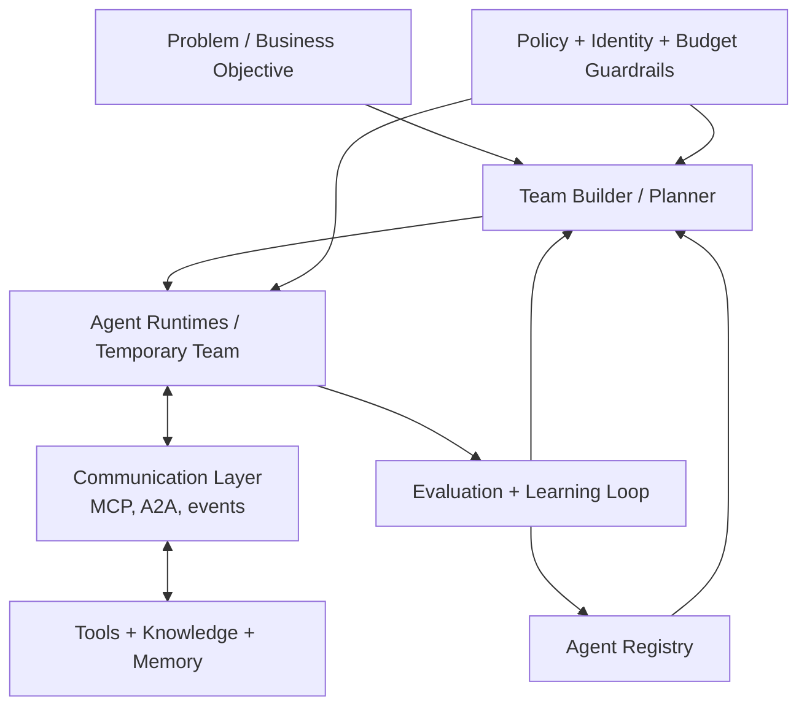

## Main Point

Recently, one of my leaders challenged me with a vision of fully autonomous agentic systems.

 Firstly, I was a little bit offended, we already build agentic systmes why he didn't see it, but then I realized that he is right, we aren't building agentic system, we were building **REST style facade on top of agent workflow**.
 This is the mismatch.

 I realized that I need to change my way of thinking about the AI agentic systems, and stopped asking questions: 
 - how the input should look like
 - what enpoints we need
 - how to build the orchestration layer

I decided to educate myself and started to think about how we should change our way of thinking about the AI systems? I started with first principles and definitions, what is an agent? How he communicate? Why he/she/it exists? 

This led me to the following conclusion:
 
  What stayed with me was a different question: **what kind of engineering practices and architecture would actually make that possible in a company?**

Many teams are already building agents. Some are even building multi-agent systems. But in my experience, they still think about them with an old software mindset. The agent sits behind a request-response facade, usually shaped like another API, and the surrounding system is still designed like a microservice pipeline with better prompts.

That is the mismatch.

The useful interface of an agent is not only an endpoint. It is also a capability surface, a delegation surface, and a policy boundary. This is why protocols such as `MCP` and `A2A` matter. They are not implementation details. They are early signs that agents need a different systems model than classic service decomposition.

I am not claiming this is a brand new insight. Many people in the field are arriving at similar conclusions. But I do think engineering teams, and often senior leaders, still underestimate how much mindset change this requires.

## Why This Matters

The problem is not that teams are ignoring agents. The problem is that even when they adopt them, they often keep the old assumptions:

- interaction is synchronous
- ownership is static
- interfaces are manually wired
- permissions are attached to fixed services
- failures are handled like ordinary retries

This works for narrow workflows. It breaks down when agents need to discover each other, delegate work, wait for approvals, resume later, or operate under explicit cost and time limits.

So the real question is not "how do I add agents to my stack?" It is "what changes when software components are no longer passive services, but active specialists that collaborate under uncertainty?"

## From Service Graphs to Dynamic Teams

The most useful mental model I have found is to stop thinking about agent systems as static pipelines and start thinking about them as **dynamic teams assembled around a problem**.

In that model:

1. The company starts with a problem, not with a predefined workflow.
2. The problem is usually underspecified and refined iteratively.
3. The organization has a pool of agents with different skills, tools, cost profiles, and operating constraints.
4. A temporary team is assembled for a concrete objective.
5. That team gets a budget: time, tokens, tool calls, money, and escalation rights.
6. The outcome is evaluated, and the trace feeds back into the system.

This is much closer to how real organizations operate. Teams form around goals, not around permanent RPC chains.

What I like about this model is that it makes the hidden components visible. In most demos, the only thing you see is the agent. In production, the more important part may be everything around it: registry, communication layer, evaluation loop, policy, and budget control.

## The Engineering Shift

Once you adopt this mental model, several engineering consequences follow immediately.

### 1. Agent interfaces are not just REST

This is the part I think many teams still miss.

If one service calls another with a stable schema and a short-lived response, `REST` is fine. But if one agent needs to discover another agent's capabilities, negotiate a delegated task, stream progress, or call tools through typed schemas, the interface starts looking different.

`MCP` is useful because it exposes capabilities in a machine-readable way: tools, resources, prompts, and schemas. `A2A` is useful because it treats delegation as a first-class operation rather than as an improvised API call. I expect the enterprise stack to split along these lines: one layer for capability access, another for agent-to-agent work.

That is a more interesting shift than "agents can call APIs." We are moving toward systems where agents can be discovered and composed through protocols designed for collaboration rather than only invocation.

### 2. Orchestration becomes a runtime problem

The second shift is that orchestration stops being only a prompt or graph design problem.

If an agent can pause, wait for a human, recover from failure, resume the next day, or retry only one expensive step, then we are already in workflow-runtime territory. Durable execution, checkpoints, replay, idempotent side effects, and structured traces stop being optional.

This is why I find systems like Temporal and LangGraph interesting. Not because they make agents more intelligent, but because they admit an uncomfortable truth: useful agent systems are long-running distributed processes.

By contrast, model serving itself is becoming a commodity. I can buy inference from a cloud provider. I cannot yet buy a clean answer to cross-agent identity, replayable execution, and organization-wide policy control.

### 3. Discoverability becomes a core capability

In a serious multi-agent environment, every agent should answer questions like:

- what can I do?
- what tools can I use?
- what tasks should be routed to me?
- what is my cost profile?
- what is my success history?

This is not a documentation problem. It is part of the execution model.

I increasingly suspect that enterprise agent platforms will compete less on prompts and more on the quality of their capability registry, routing, and trace data.

## A Small Internal Agent Economy

Once teams of agents are formed dynamically, architecture becomes partly an economic problem.

Not in the hype sense. In the engineering sense.

Every non-trivial system will have to decide:

- when to use a cheap agent versus an expensive one
- when to ask a verifier to re-check work
- when to escalate to a stronger model
- when to stop because the budget is no longer justified
- how to route work based on expected value, not only raw quality

This is why I wanted to keep the idea of an **agent economy** in the article, even after trimming it. A temporary team should not be allowed to consume unlimited time and money just because it can keep thinking.

The recent paper **Self-Resource Allocation in Multi-Agent LLM Systems** is useful here because it treats coordination as a resource-allocation problem. And **The Agentic Economy** makes a broader point that I also find relevant inside companies: when communication becomes cheaper, the structure of the system changes, not only its speed.

My version of this idea is simpler and more practical. Inside the enterprise, agent systems will need explicit budget policies, routing rules, and escalation thresholds. Otherwise "autonomy" just becomes an expensive form of drift.

## The Hardest Unsolved Layer

For me, the hardest part is still identity and authorization.

This problem is much more difficult than the standard enterprise `RBAC` model we use for human users and fixed services. With agents, the situation changes constantly:

- agents can be created dynamically
- prompts can change their effective responsibilities
- the same agent may act under different delegations
- tool access may become invalid after a role change
- permissions that were safe yesterday may be unsafe after an update

This is why I think the control plane matters so much. Without an explicit layer for identity, delegation, budget, and auditability, the rest of the architecture is fragile no matter how smart the model is.

The most interesting research question for me is no longer "can agents collaborate?" It is "how do we govern collaboration when the collaborators are dynamic software entities whose behavior can shift faster than our permission models?"

## Where I Think This Is Going

I do not think the winning enterprise pattern will be a giant autonomous swarm.

I expect something more structured:

- agents as specialists, not magical general workers
- dynamic teams assembled around goals
- protocol-native communication
- durable workflow runtimes
- budget-aware routing
- explicit policy and identity layers
- evaluation loops that improve the system over time

That is why I keep coming back to the same conclusion: the main challenge is not agent orchestration in the narrow sense. It is learning to design a new operating model for machine collaborators.

## Selected References

1. Qian et al., ["Scaling Large-Language-Model-based Multi-Agent Collaboration"](https://hf.co/papers/2406.07155)
2. Amayuelas et al., ["Self-Resource Allocation in Multi-Agent LLM Systems"](https://hf.co/papers/2504.02051)
3. Ehtesham et al., ["A survey of agent interoperability protocols: Model Context Protocol (MCP), Agent Communication Protocol (ACP), Agent-to-Agent Protocol (A2A), and Agent Network Protocol (ANP)"](https://hf.co/papers/2505.02279)
4. Kandasamy, ["Control Plane as a Tool: A Scalable Design Pattern for Agentic AI Systems"](https://hf.co/papers/2505.06817)
5. Yang et al., ["Agentic Web: Weaving the Next Web with AI Agents"](https://hf.co/papers/2507.21206)
6. Derouiche et al., ["Agentic AI Frameworks: Architectures, Protocols, and Design Challenges"](https://hf.co/papers/2508.10146)
7. Temporal, ["Build resilient Agentic AI with Temporal"](https://temporal.io/blog/build-resilient-agentic-ai-with-temporal)
8. Anthropic, ["Model Context Protocol Documentation"](https://modelcontextprotocol.io/docs/concepts/tools)
9. Google, ["A2A GitHub Repository"](https://github.com/google/A2A)
