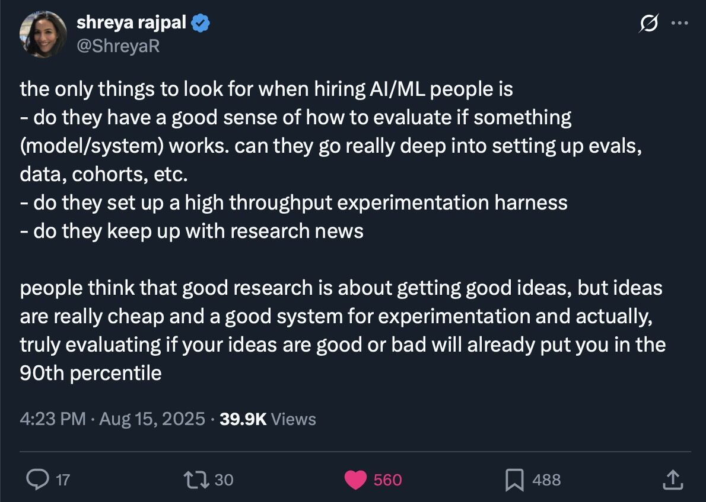

A recent tweet by Shreya Rajpal sparked a great conversation about what to look for in AI/ML talent, emphasizing systems for evaluation and experimentation. It’s a crucial point, especially for building teams that can iterate quickly. But it also got me thinking about the deeper qualities that I’ve seen in the truly exceptional AI/ML scientists I’ve had the privilege to work with.

Frameworks, libraries, and programming languages are just tools. They can be learned. The underlying hardware of a great mind, however, is much rarer and harder to build. I believe it comes down to three core, almost innate, qualities.

### 1. The Ability to See the Essence

The most impactful scientists I know have a unique ability to cut through the noise. They can take a complex, ill-defined problem and distill it down to its absolute essence. This isn't about oversimplifying; it's about profound clarity.

This deep thinking allows them to focus their energy and the team's resources on what truly matters. Instead of running a hundred scattered experiments, they design a handful of critical ones that strike at the heart of the problem. They're not just asking "what works?" but "what is the fundamental principle I need to understand here?".

### 2. The Rigor to Test and Harvest Truth

An idea is just a starting point. The second quality is the discipline to properly test a hypothesis and the skill to do it at scale. This is more than just running code; it's a scientific art.

It involves:
*   **Designing clean experiments:** Isolating variables and understanding confounders.
*   **Evaluating at scale:** Building the systems to quickly see if a small-scale success holds up under real-world pressure.
*   **Harvesting results:** Once the data is in, they can dig into it, separating the genuine signal from the noise, and extracting the core insight.

This loop—hypothesize, test, analyze, repeat—is the engine of progress, and great scientists are masters of navigating it with both speed and precision.

### 3. The Vision to Connect the Dots

The third, and perhaps most elusive, quality is the ability to synthesize. Breakthroughs often don't come from a single, linear path of inquiry. They come from connecting disparate ideas from seemingly unrelated fields.

A great researcher might take a concept from computational biology, an insight from a classic physics paper, and a technique from modern reinforcement learning, and see a novel way to combine them. This "polymath" tendency is a creative superpower. It's the ability to see the underlying patterns that connect different domains of knowledge and weave them into something entirely new.

## Tools Are Temporary, Traits Are Foundational

We spend a lot of time talking about the latest frameworks and models. But these are ephemeral. What truly sets the best apart are these foundational human qualities: the depth to find the essence, the rigor to test it, and the vision to connect it with the rest of the world's knowledge.

Some have these qualities, others do not. And while they can be honed and developed, I believe they are largely innate. When building a team, I’ve learned that it's these traits, not a list of technologies on a resume, that are the true indicators of a scientist who will drive genuine innovation.
